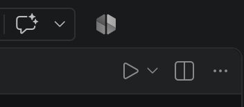

# Five Stones

Denys Khliustin

You have arrived in a new world that has not yet developed as far as our own.
Explore the Renewal Village, Riverlands, Living Forest, Knowledge Highlands, and
Unity Commons to find five legendary Infinity Stones, one in each location. Use
their power to help transform the world into a fair and sustainable place where
everyone can thrive, without leaving anyone behind. Your journey will bring the
world closer to all 17 United Nations Sustainable Development Goals, balancing
people's well-being, prosperity, and care for the planet.

## Launch instructions

Download last Python version

Use file  "launch.py" to launch the game. 

On mac: right-click on the file --> open with --> Python Launcher 
On windows: right-click on the file --> open with --> Python

It's also possible to open it with vscode
Download and open vscode --> download Python extension --> press launch button in the top right corner (see image below)

## Project structure

The game is split into a small package so that each class has one clear responsibility:

project/

├── launch.py       # Starts the game

├── intro.txt          # Introductory text shown at startup

├── instructions.txt   # Player instructions shown at startup

├── save.json          # Player saves (created automatically)

├── readme.md          # Project documentation

└── game/

	├── __init__.py    # Exposes Item, Player, and Room
	
	├── game.py        # Creates the world and runs the menu
	
	├── item.py        # Item class
	
	├── player.py      # Player class and player actions
	
	├── room.py        # Room class and room connections
	
	└── saves.py       # Saves and restores game state

`Player` stores the player's name, inventory, and current room. `Room` stores its name, exits, and an optional item. `Item` stores an item's name and weight. At startup, the game reads `intro.txt` and `instructions.txt`, then creates one player and a connected world of five locations, each containing one unique Infinity Stone, unless a save exists for the entered name. Collect all five stones to complete the adventure and transform the world toward all 17 United Nations Sustainable Development Goals. Progress is automatically saved as JSON text in `save.json`, including the player's location, inventory, and remaining room items. Enter the same name at startup to continue that player's game.
